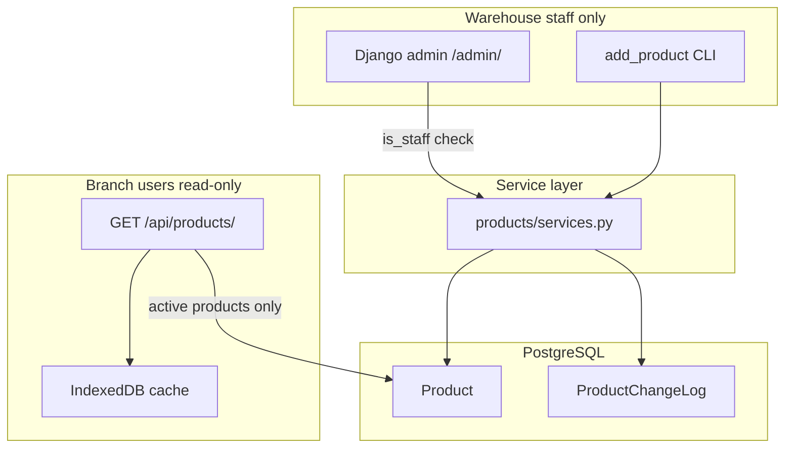

# Catalog Management with Audit Trail

## Recommendation: greenfield DB reset

**Yes — reset the database.** You have no production data, and [`products/migrations/0001_initial.py`](products/migrations/0001_initial.py) is a three-field `Product` table with no admin registered. Adding lifecycle fields + a new audit model is cleaner as **one fresh products migration** than layering `0002` patches.

After implementation:

```bash
# drop and recreate DB (or DROP DATABASE centcompras_db; CREATE DATABASE ...)
python manage.py migrate
python manage.py createsuperuser   # warehouse staff user with is_staff=True
```

No changes to `accounts` or `branches` migrations — only replace/regenerate the **products** migration.

---

## Scope

**In:**
- Richer `Product` model (lifecycle + optional `internal_code`)
- `ProductChangeLog` audit table (who, what, when)
- [`products/services.py`](products/services.py) — sole mutation path (create / update / deactivate / reactivate)
- Django admin for warehouse staff (`is_staff` only)
- Branch catalogue API returns **active products only** (read-only, unchanged access model)
- Update CLI to route through services (dev/bootstrap; audit records `user=None`)

**Out (later phases):**
- Branch-facing catalog management
- Plain HTML warehouse UI (admin is enough for now)
- LLM / vector search on `description` (field stays; search is future work)
- Automated tests (optional small set after manual verification)
- Stock changes from orders

---

## Data model

### `Product` (extended)

| Field | Type | Notes |
|-------|------|-------|
| `internal_code` | `CharField`, blank=True | Optional warehouse code; **unique when non-empty** (`UniqueConstraint` with condition) |
| `description` | existing | Kept for display + future semantic/substitution lookup |
| `stock` | existing `DecimalField` | |
| `price` | existing `DecimalField` | |
| `is_active` | `BooleanField`, default `True` | Soft delete when `False` |
| `created_at` | `auto_now_add` | |
| `updated_at` | `auto_now` | |

Add a small `ProductQuerySet.active()` / `.include_inactive()` pattern (mirrors the planned `OrderQuerySet.for_branch` style in [`docs/warehouse-tenancy-setup.md`](docs/warehouse-tenancy-setup.md)).

### `ProductChangeLog` (new)

| Field | Type | Notes |
|-------|------|-------|
| `product` | FK → `Product`, `PROTECT` | Keeps history even if product is deactivated |
| `user` | FK → `accounts.User`, `SET_NULL`, null=True | `None` for CLI/bootstrap |
| `action` | choices: `created`, `updated`, `deactivated`, `reactivated` | |
| `changes` | `JSONField` | Field-level diff, e.g. `{"price": {"old": "12.95", "new": "14.00"}}` |
| `created_at` | `auto_now_add` | Immutable — append-only |

No hard deletes on `Product` anywhere.



---

## Service layer ([`products/services.py`](products/services.py))

All mutations run inside `@transaction.atomic` and write both `Product` and `ProductChangeLog`.

| Function | Behaviour |
|----------|-----------|
| `create_product(user, description, stock, price, internal_code="")` | Create active product; log `created` with initial snapshot |
| `update_product(user, product, **fields)` | Allowed: `description`, `stock`, `price`, `internal_code`; log `updated` with per-field old/new in `changes` |
| `deactivate_product(user, product)` | Set `is_active=False`; log `deactivated` |
| `reactivate_product(user, product)` | Set `is_active=True`; log `reactivated` |
| `get_products(active_only=True)` | Default `True` — filters `is_active=True`, orders by `id` |
| `get_product_history(product)` | Returns change log queryset, newest first |

Internal helper `_log_change(product, user, action, changes)` keeps logging DRY.

**CLI** ([`products/management/commands/add_product.py`](products/management/commands/add_product.py)): add optional `--internal-code`; call `create_product(user=None, ...)`.

---

## Permissions

New [`products/permissions.py`](products/permissions.py):

```python
def can_manage_catalog(user):
    return user.is_authenticated and user.is_staff
```

Used in admin overrides only — branch roles in [`branches/permissions.py`](branches/permissions.py) are untouched.

---

## Django admin ([`products/admin.py`](products/admin.py))

Currently empty — wire it up:

- **`ProductAdmin`**
  - `list_display`: `id`, `internal_code`, `description`, `stock`, `price`, `is_active`, `updated_at`
  - `list_filter`: `is_active`
  - `search_fields`: `internal_code`, `description`
  - Override `save_model` / custom actions to call **services** (never `super().save_model` direct writes)
  - Admin action: "Deactivate selected" → `deactivate_product`
  - Admin action: "Reactivate selected" → `reactivate_product`
  - Permission hooks: `has_add_permission`, `has_change_permission`, `has_delete_permission` → `can_manage_catalog`; **disable hard delete** (`has_delete_permission` returns `False`)

- **`ProductChangeLogAdmin`** (read-only)
  - Inline on product detail **or** separate list filtered by product — read-only, no add/change/delete
  - Shows user email, action, timestamp, formatted `changes` JSON

Warehouse staff = any `User` with `is_staff=True` (set via admin or `createsuperuser`).

---

## Branch catalogue (minimal touch)

[`products/views.py`](products/views.py) — no auth model change. `get_products()` already used; once it defaults to `active_only=True`, deactivated products disappear from:

- `GET /api/products/`
- IndexedDB sync (client replaces full cache on fetch)

No new fields exposed to branch API in this phase unless you want `internal_code` visible — **recommend omitting** from JSON for now (warehouse-internal).

---

## Migration strategy (greenfield)

1. Update [`products/models.py`](products/models.py) with extended `Product` + `ProductChangeLog`
2. **Delete** [`products/migrations/0001_initial.py`](products/migrations/0001_initial.py)
3. `python manage.py makemigrations products` → single new `0001_initial.py`
4. Drop/recreate `centcompras_db` (or `flush` if preferred)
5. `python manage.py migrate`

Existing products in dev DB (if any) are discarded — acceptable per your greenfield note.

---

## Documentation updates

- [`README.md`](README.md) — catalog management via `/admin/` for staff; soft delete; audit log; CLI is dev-only
- [`AGENTS.md`](AGENTS.md) — replace "Products created via CLI only" with "branch users read-only; warehouse staff manage via admin + services"
- [`.cursor/rules/centcompras-core.mdc`](.cursor/rules/centcompras-core.mdc) — same constraint update
- [`products/products_docs/aux_instructions.md`](products/products_docs/aux_instructions.md) — section 4 restriction softened for staff admin path

---

## Manual test checklist

1. Fresh migrate succeeds
2. `createsuperuser` → staff user can add/edit/deactivate products in `/admin/products/product/`
3. Non-staff branch user **cannot** access product admin
4. `GET /api/products/` as branch user — only active products returned
5. Deactivate a product → disappears from API and next IndexedDB refresh
6. `ProductChangeLog` shows create, field edit (with old/new values), deactivate, reactivate with correct user email
7. `python manage.py add_product "Test" 10 5.00` → product created, log entry with `user=None`
8. Duplicate non-empty `internal_code` rejected at DB/service level

---

## Phase sequence (implementation order)

1. Models + fresh migration
2. Services + permissions
3. Admin wiring (mutations + read-only history)
4. CLI update
5. API filter (via `get_products`)
6. Docs

One module, one concept — no orders, no new apps.
