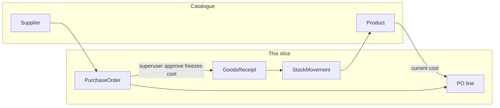

# Procurement: PO then receipt

## What this slice does

Warehouse staff raise a **purchase order** to an existing supplier, a **superuser approves** it, then a **goods receipt** increases on-hand stock. Staff never type money on the PO: they pick product and supplier from dropdowns and type **quantity** only.

## Current prices vs purchase history

Two jobs; do not mix them in a Product → Price foreign key.

**Current catalogue prices** (Prices drawer) — **columns on [`Product`](products/models.py):**

- `cost` (new), `wholesale` (new), `price` (existing = sell)
- Default `0`. Same Decimal type as today.
- Product create/edit form stays quiet: **do not** add cost/wholesale there. Toolbar **Prices** drawer (same pattern as Families / Suppliers). Grid keeps one Price column (sell). Stock on the product form becomes **read-only**.

**Purchase-price history** (inflation / metrics later) — **approved [`PurchaseOrderLine`](procurement/models.py) rows:**

- product, supplier (PO header), frozen `unit_cost`, qty, `approved_at` / `received_at`
- History is per supplier even without a supplier cost list
- Freeze **at approve**, not when the line is first added. After approve, changing `Product.cost` must not rewrite the line
- No metrics/charts UI in this slice; the data is the lines

`ProductChangeLog` still records list-price edits (who changed cost/sell/wholesale). That is not the purchase series.

## Flow

- **draft → submit (pending_approval) → superuser approve → receive**
- Any `is_staff` may draft and submit. Only `is_superuser` may approve
- Seeded `warehouse@centcompras.dev` cannot approve (staff, not superuser). Practice with the site superuser
- Partial receipts allowed; no over-receive; no receipt void
- New products still start inactive (Genesis) with stock **0**
- `create_product` always stock 0; `apply_stock_change` in [`products/services.py`](products/services.py) is the only quantity write

## Models

**products:** `StockMovement` (product, signed qty, reason, source_type/source_id, user). Remove `stock` from `UPDATABLE_FIELDS`.

**procurement:**

- `PurchaseOrder`: supplier, status (`draft` / `pending_approval` / `approved` / `cancelled`), created_by, approved_by, notes
- `PurchaseOrderLine`: product, quantity_ordered, unit_cost (snapshot), unique per PO+product
- `GoodsReceipt` + `GoodsReceiptLine` against outstanding qty

Cancel: draft, pending_approval, or approved with zero receipts.

## UI

- [`/manage/procurement/`](procurement/web_urls.py) — list + drawer; EN/pt-PT; reuse [`console.css`](products/static/products/css/console.css)
- Nav on both staff pages: Products | Purchases
- PO: product dropdown (code + description), supplier dropdown, qty typed, cost shown read-only
- Staff: Save, Submit for approval, Cancel. Superuser: Approve, then Receive

## Out of this slice

Per-supplier list cost, inflation charts, picking sell/wholesale on a PO, extra approval role flag, over-receive, invoices, branch orders, phone catalogue UX.
