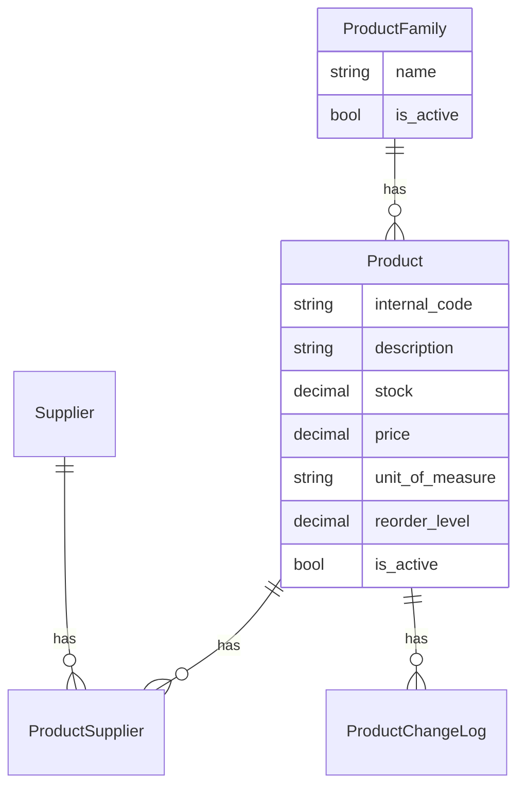

# Product family, unit of measure, reorder level (greenfield)

## Context

- **Dev greenfield:** you will drop/recreate the database — no production data, no row backfill.
- **Family is required** on every `Product` from day one (non-null FK in initial migration).
- **Branch API unchanged** this phase ([`products/views.py`](products/views.py)).

## Decisions

| Topic | Choice |
|-------|--------|
| ProductFamily | Separate flat table; **required** FK on `Product` |
| Unit of measure | Django `TextChoices` dropdown in admin |
| Reorder minimum | `reorder_level` on `Product`, **default 0** (`> 0` = threshold set) |
| Branch API | No changes |
| Seed volume | **Large** — ~12 families, ~50 products, ~12 suppliers |
| Migrations | **Squash products app** into one clean `0001_initial` |

## Migration strategy (recommended: squash products app)

**Recommendation: Option A — squash** ([`products/migrations/`](products/migrations/))

Why this fits greenfield dev:

- `family` is non-null from the first migration — no nullable → backfill → alter dance.
- One file reflects the real model graph (Product, ProductChangeLog, Supplier, ProductSupplier, ProductFamily).
- You already wipe the DB; old migration history has no value for teammates until prod exists.

**Steps:**

1. Delete [`0001_initial.py`](products/migrations/0001_initial.py), [`0002_productchangelog_reason.py`](products/migrations/0002_productchangelog_reason.py), [`0003_supplier_productsupplier.py`](products/migrations/0003_supplier_productsupplier.py).
2. `makemigrations products` → new single `0001_initial.py` with **all** current + new models/fields.
3. **Do not squash** `accounts` / `branches` migrations — only products app; other apps keep their history and run normally on fresh DB.

**Your reset workflow after implementation:**

```bash
# drop DB (psql or your usual method), then:
python manage.py migrate
./scripts/seed_dev_data.sh
```

## Data model



### [`products/models.py`](products/models.py)

**`ProductFamily`** (new):

- `name` — unique `CharField(max_length=255)`
- `is_active` — default `True`
- `created_at`, `updated_at`
- `Meta.ordering = ["name"]`
- Flat — no `parent` FK yet

**`Product`** — add:

- `family` — `ForeignKey(ProductFamily, on_delete=PROTECT, related_name="products")` — **non-null**
- `unit_of_measure` — `CharField` + `TextChoices`: `piece`, `kg`, `g`, `m`, `m2`, `m3`, `l`
- `reorder_level` — `DecimalField(max_digits=12, decimal_places=3, default=0)`

Existing models unchanged: `Supplier`, `ProductSupplier`, `ProductChangeLog`.

## Services — [`products/services.py`](products/services.py)

**ProductFamily** (mirror supplier pattern, no audit log):

- `create_product_family(name)`
- `update_product_family(family, **fields)` — `name`, `is_active`
- `get_product_families(active_only=True)`

**Product mutations:**

- Extend `UPDATABLE_FIELDS`: `family`, `unit_of_measure`, `reorder_level`
- `create_product(...)` — **required** `family`, `unit_of_measure`; optional `reorder_level` (default `0`)
- Audit log: serialize `family` changes (id + name) in `ProductChangeLog.changes`
- `get_products(family=None, active_only=True)` — optional family filter

## Warehouse admin — [`products/admin.py`](products/admin.py)

- **`ProductFamilyAdmin`** — list/search/filter; `product_count`; `can_manage_catalog`; no hard delete
- **`ProductAdmin`** — add `family` (autocomplete), `unit_of_measure`, `reorder_level`; `list_filter` on `family`, `unit_of_measure`; pass new fields to services on save

## Seed — large dummy dataset

Refactor [`branches/management/commands/seed_dev_data.py`](branches/management/commands/seed_dev_data.py) to import structured data from a dedicated module (keeps command readable):

**New file:** [`products/seed_catalog_data.py`](products/seed_catalog_data.py) (or `products/seed_data.py`)

### Families (~12)

Examples: Cement, Aggregates, Pipes, Steel, Timber, Tools, Electrical, Plumbing, Paint, Safety, Fasteners, Misc.

- Include **1 inactive family** (e.g. `Legacy stock`) for admin filter testing.

### Suppliers (~12)

- Mix of contact fields filled/empty
- Include **2 inactive suppliers** for filter testing

### Products (~50)

Structured rows: `internal_code`, `description`, `family`, `unit`, `stock`, `price`, `reorder_level`, optional `is_active` flag.

Design for **visualization**:

| Pattern | Purpose |
|---------|---------|
| ~45 active products | Normal changelist volume |
| ~5 deactivated | `is_active` filter |
| Spread across all families | Family filter shows meaningful counts |
| Varied UOM | Each choice used at least once |
| `reorder_level = 0` | No threshold |
| `stock < reorder_level` | ~8 products — “below reorder” when browsing admin |
| `stock >= reorder_level` | Majority — healthy stock |

### Supplier links

- Cement family products → 2–4 suppliers each (multi-supplier demo)
- Other families → 1–2 suppliers each
- Idempotent: `get_or_create` + `link_product_supplier` (same as today)

### Seed order in command

1. Warehouse user + branches + branch users (unchanged)
2. Families
3. Suppliers
4. Products (via `create_product` with family + unit)
5. Product–supplier links

## CLI — [`products/management/commands/add_product.py`](products/management/commands/add_product.py)

- `--family` (required) — family name lookup
- `--unit` (default `piece`)
- Optional `--reorder-level` (default `0`)

## Out of scope

- Branch API / IndexedDB / offline cache
- ProductFamily hierarchy
- Low-stock alerts UI / procurement
- Squashing non-products app migrations

## Tests — [`products/tests.py`](products/tests.py)

- `create_product` requires family + unit; updates audit new fields
- `get_product_families(active_only=True)`
- `get_products(family=...)` filter
- `ProductFamilyAdmin` access (staff yes, branch admin no)
- Update **all** existing `create_product(...)` calls with a test family helper in `setUp`
- Seed idempotency test still passes with larger catalog

Run: `.venv/bin/python manage.py test products accounts branches`

## File touch list

| File | Change |
|------|--------|
| [`products/models.py`](products/models.py) | `ProductFamily`, `Product` fields |
| [`products/migrations/`](products/migrations/) | Delete 0001–0003; new squashed `0001_initial` |
| [`products/seed_catalog_data.py`](products/seed_catalog_data.py) | Large FAMILIES / SUPPLIERS / PRODUCTS / LINKS constants |
| [`products/services.py`](products/services.py) | Family CRUD + extended product CRUD |
| [`products/admin.py`](products/admin.py) | `ProductFamilyAdmin`, `ProductAdmin` fields |
| [`branches/management/commands/seed_dev_data.py`](branches/management/commands/seed_dev_data.py) | Import seed data; seed families/products/suppliers |
| [`products/management/commands/add_product.py`](products/management/commands/add_product.py) | `--family`, `--unit`, `--reorder-level` |
| [`products/tests.py`](products/tests.py) | New + updated tests |
