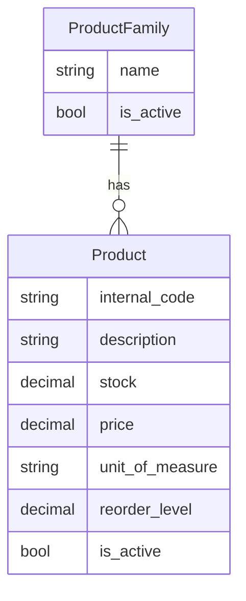

# Product family, unit of measure, reorder level

## Decisions (from your answers)

| Topic | Choice |
|-------|--------|
| ProductFamily | Separate flat table; **required** on every product |
| Unit of measure | Django `TextChoices` dropdown in admin |
| Reorder minimum | `reorder_level` on `Product`, **default 0** (only `> 0` is a real threshold) |
| Branch API | **No changes** — warehouse admin only this phase |

## Data model



### [`products/models.py`](products/models.py)

**`ProductFamily`** (new) — mirror [`Supplier`](products/models.py) simplicity:
- `name` — `CharField(max_length=255)`, unique
- `is_active` — `BooleanField(default=True)`
- `created_at`, `updated_at`
- `Meta.ordering = ["name"]`

**`Product`** — add:
- `family` — `ForeignKey(ProductFamily, on_delete=models.PROTECT, related_name="products")` — **non-null** after data migration
- `unit_of_measure` — `CharField` with `TextChoices` (initial set):
  - `piece`, `kg`, `g`, `m`, `m2`, `m3`, `l`
- `reorder_level` — `DecimalField(max_digits=12, decimal_places=3, default=0)` (same precision as `stock`)

**`ProductFamily` is flat** — no `parent` FK yet; hierarchy can be added later as nullable `parent` on `ProductFamily` without touching `Product`.

### Migration strategy ([`products/migrations/0004_...`](products/migrations/))

Because `family` is required but rows may already exist:

1. Create `ProductFamily` table.
2. Add `family` (nullable), `unit_of_measure` (default `piece`), `reorder_level` (default `0`).
3. **RunPython** data step: create family `"General"`, assign all existing products to it.
4. Alter `family` to non-null + `PROTECT`.

Seed script will then replace/assign real families (`Cement`, `Aggregates`, `Pipes`) on sample products.

## Services layer — [`products/services.py`](products/services.py)

Follow existing supplier pattern:

**ProductFamily CRUD** (no audit log — same as suppliers):
- `create_product_family(name)`
- `update_product_family(family, **fields)` — `name`, `is_active`
- `get_product_families(active_only=True)`

**Extend product mutations**:
- Add to `UPDATABLE_FIELDS`: `family`, `unit_of_measure`, `reorder_level`
- Extend `create_product(...)` — **required** `family` (instance or id), `unit_of_measure`, optional `reorder_level` (default `0`)
- Audit log (`ProductChangeLog`) — serialize `family` changes as `family_id` / family name in JSON (same pattern as other fields)
- `_serialize_value` — handle FK for audit diffs

**Read helpers** (warehouse lookups):
- `get_products_by_family(family, active_only=True)` — optional filter on existing `get_products` via queryset param or dedicated helper

## Warehouse admin — [`products/admin.py`](products/admin.py)

**`ProductFamilyAdmin`** (new) — same permission gate as suppliers (`can_manage_catalog`):
- Changelist: name, `product_count`, `is_active`, `updated_at`
- Search on `name`; filter `is_active`
- Saves via `create_product_family` / `update_product_family`
- No hard delete (`has_delete_permission` → False)

**`ProductAdmin`** updates:
- Form fields: `family` (autocomplete), `unit_of_measure`, `reorder_level` + existing fields
- `list_display`: add `family`, `unit_of_measure`, `reorder_level`
- `list_filter`: add `family`, `unit_of_measure`
- `save_model` passes new fields into `create_product` / `update_product`

## Seed — [`branches/management/commands/seed_dev_data.py`](branches/management/commands/seed_dev_data.py)

```text
FAMILIES = ("Cement", "Aggregates", "Pipes")
PRODUCT_FAMILY_MAP = CEM-50 → Cement, SAND-1KG → Aggregates, PIPE-20 → Pipes
PRODUCT_UOM_MAP = CEM-50 → kg, SAND-1KG → kg, PIPE-20 → m
```

- Create families idempotently before products.
- `create_product` calls include `family` + `unit_of_measure` (+ sample `reorder_level` where useful, e.g. cement `10`).

## CLI — [`products/management/commands/add_product.py`](products/management/commands/add_product.py)

Add required args/options:
- `--family` — family name (lookup or error if missing)
- `--unit` — choice value (default `piece`)

## Out of scope (explicit)

- Branch API / offline IndexedDB / [`products/views.py`](products/views.py) — unchanged
- ProductFamily hierarchy (`parent` FK)
- Low-stock alerts UI or procurement workflow
- Supplier junction changes

## Tests — [`products/tests.py`](products/tests.py)

Add coverage for:
- `create_product` requires family + unit; audit log includes new fields on update
- `get_product_families(active_only=True)` excludes inactive families
- Product cannot be created without family (service-level)
- `ProductFamilyAdmin` — staff can open changelist; branch admin cannot
- Existing product tests updated for new `create_product` signature

Run: `.venv/bin/python manage.py test products accounts branches`

## File touch list

| File | Change |
|------|--------|
| [`products/models.py`](products/models.py) | `ProductFamily`, `Product` fields |
| [`products/migrations/0004_...`](products/migrations/) | schema + backfill |
| [`products/services.py`](products/services.py) | family CRUD + extended product CRUD |
| [`products/admin.py`](products/admin.py) | `ProductFamilyAdmin`, `ProductAdmin` fields |
| [`branches/management/commands/seed_dev_data.py`](branches/management/commands/seed_dev_data.py) | families + mapped products |
| [`products/management/commands/add_product.py`](products/management/commands/add_product.py) | `--family`, `--unit` |
| [`products/tests.py`](products/tests.py) | new + updated tests |
